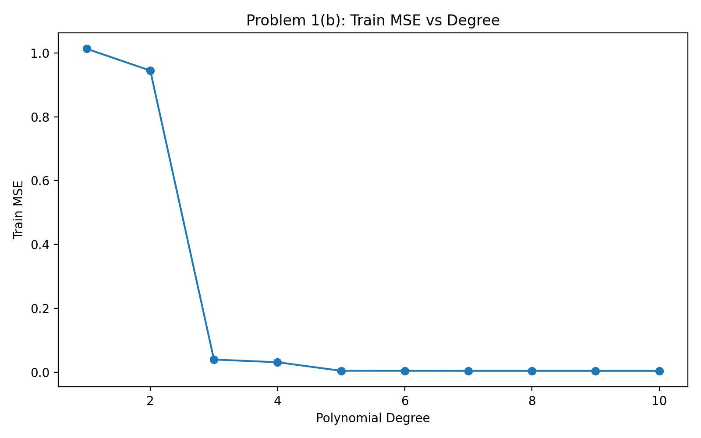
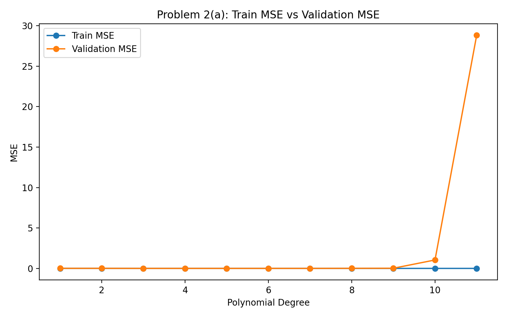
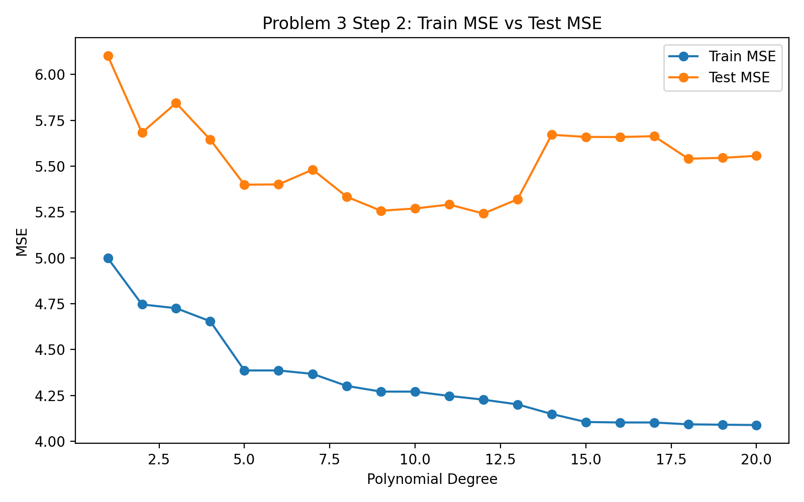

# Homework 1-1 Report

**Group Number:** [請填寫]

**Group Members**

- [成員姓名 1] ([學號 1]): [__]%
- [成員姓名 2] ([學號 2]): [__]%
- [成員姓名 3] ([學號 3]): [__]%

註：請確認貢獻比例總和為 100%。

## Part 1-1 (a)

本題使用 `dataset1.csv` 進行二次多項式回歸。為了避免高次多項式在數值上不穩定，我們先將輸入 `x` 正規化到 `[0,1]`，再建立 degree = 2 的 polynomial features，最後以線性回歸估計係數。模型得到的參數如下：

- `w0 = 2.2375`
- `w1 = -6.7654`
- `w2 = 3.5021`

訓練誤差為 `Train MSE = 0.9447`。由此可見，二次模型可以捕捉到部分非線性趨勢，但對資料的擬合仍有限。

## Part 1-1 (b)

本題比較 degree = 1 到 10 的多項式模型在訓練資料上的表現。結果顯示，隨著 degree 增加，訓練 MSE 持續下降，代表模型自由度越高時，越能貼近訓練資料。部分結果如下：

| Degree | Train MSE |
| --- | ---: |
| 1 | 1.0129 |
| 2 | 0.9447 |
| 3 | 0.0398 |
| 5 | 0.0046 |
| 8 | 0.0044 |
| 10 | 0.0044 |

從圖中可觀察到，degree 從 1 增加到 3 時誤差大幅下降，之後下降幅度趨緩。這表示資料的主要非線性結構大致可由中低次多項式描述，而更高次的模型雖然能進一步降低訓練誤差，但改善已經有限。

## Part 1-1 (c)

本題比較 degree = 3 與 degree = 8 的擬合結果。其訓練誤差分別為：

- degree = 3: `MSE = 0.0398`
- degree = 8: `MSE = 0.0044`

雖然 degree = 8 的訓練誤差更低，但從擬合曲線可以看出它比 degree = 3 更彎曲，對局部資料點更敏感。degree = 3 已能平滑地描述整體趨勢；degree = 8 則可能開始學到雜訊，因此具有較高的 overfitting 風險。

## Part 1-2 (a)

本題使用 `dataset2.csv`，依照 `split` 欄位分成 training set 與 validation set，並比較不同多項式次數的 train/validation MSE。結果如下：

| Degree | Train MSE | Validation MSE |
| --- | ---: | ---: |
| 1 | 0.0053 | 0.0075 |
| 3 | 0.0007 | 0.0010 |
| 5 | 0.0004 | 0.0006 |
| 7 | 0.0003 | 0.0005 |
| 8 | 0.0002 | 0.0087 |
| 10 | 0.0001 | 1.0411 |
| 11 | 0.0000 | 28.8229 |

最佳 validation 表現出現在 `degree = 7`，其 `Validation MSE = 0.000509`。當 degree 提高到 8 以上時，training MSE 繼續下降，但 validation MSE 快速惡化，尤其 degree = 11 幾乎把 training data 完全記住，卻在 validation set 上產生非常大的誤差，這是典型的 overfitting 現象。

## Part 1-2 (b)

由於 degree = 8 已出現過擬合，因此本題固定使用 degree = 8，進一步加入 Ridge regularization，比較不同 `lambda` 對模型的影響。未正規化的 baseline 結果為：

- Train MSE = `0.000167`
- Validation MSE = `0.008719`

加入 Ridge 後的結果如下：

| Lambda | Train MSE | Validation MSE |
| --- | ---: | ---: |
| 0.001 | 0.000654 | 0.000915 |
| 0.01 | 0.001249 | 0.002509 |
| 0.1 | 0.004228 | 0.005279 |
| 1.0 | 0.053190 | 0.049541 |

Ridge 在 `lambda = 0.001` 時得到最佳結果，validation MSE 從 `0.008719` 明顯降到 `0.000915`。這表示適度的 L2 regularization 能有效限制高次模型過大的係數，讓曲線更平滑，也提升模型對未見資料的泛化能力。

## Part 1-2 (c)

本題延續 degree = 8 的設定，改用 Lasso regularization。結果如下：

| Lambda | Train MSE | Validation MSE |
| --- | ---: | ---: |
| 0.001 | 0.001586 | 0.002739 |
| 0.01 | 0.007842 | 0.010879 |
| 0.1 | 0.215760 | 0.176901 |
| 1.0 | 0.341564 | 0.336517 |

Lasso 在 `lambda = 0.001` 時表現最佳，但 validation MSE 仍高於 Ridge 的最佳結果。從係數可看出，Lasso 會把部分高次項壓到 0，確實達到特徵選擇效果；然而在這個資料集上，Ridge 的平滑收縮比 Lasso 的稀疏化更適合，因此整體泛化表現較佳。

## Part 2 (a): Kaggle Dataset and Feature Selection

Part 2 使用的資料集為 Kaggle 上常見的 **Advertising** dataset，本作業使用的檔案為 `Part2/advertising.csv`。資料共有 200 筆，欄位包含 `TV`、`Radio`、`Newspaper` 與 `Sales`。本組選擇：

- Feature (`X`): `TV`
- Target (`Y`): `Sales`

選擇 `TV` 的原因是它與 `Sales` 具有明顯的正向關係，適合用來展示多項式回歸、underfitting/overfitting 與 regularization 的效果。資料摘要如下：

- `TV`: mean = 147.0425, std = 85.8542, min = 0.7000, max = 296.4000
- `Sales`: mean = 15.1305, std = 5.2839, min = 1.6000, max = 27.0000

## Part 2 (b)

本題將資料切成 80% training 與 20% testing，並比較 degree = 1 到 20 的模型。部分結果如下：

| Degree | Train MSE | Test MSE |
| --- | ---: | ---: |
| 1 | 4.9984 | 6.1011 |
| 5 | 4.3864 | 5.3991 |
| 9 | 4.2712 | 5.2571 |
| 12 | 4.2272 | 5.2418 |
| 14 | 4.1489 | 5.6713 |
| 20 | 4.0888 | 5.5566 |

最佳測試結果出現在 `degree = 12`，其 `Test MSE = 5.241831`。不過 degree 持續增加後，training MSE 雖然下降，test MSE 卻沒有同步改善，甚至在 degree = 14 後變差，表示高次模型在此資料上開始過度貼合訓練資料。

## Part 2 (c)

為了改善高次模型的過擬合，本題固定使用 `degree = 14`，分別測試 Ridge 與 Lasso。

未正規化 baseline：

- Train MSE = `4.148948`
- Test MSE = `5.671338`

Ridge 結果：

| Lambda | Train MSE | Test MSE |
| --- | ---: | ---: |
| 0.001 | 4.5686 | 5.4408 |
| 0.01 | 4.7008 | 5.6277 |
| 0.1 | 4.7755 | 5.6546 |
| 1.0 | 5.1321 | 5.8951 |

Lasso 結果：

| Lambda | Train MSE | Test MSE |
| --- | ---: | ---: |
| 0.001 | 4.7326 | 5.7381 |
| 0.01 | 4.8136 | 5.6837 |
| 0.1 | 5.0390 | 6.1058 |
| 1.0 | 9.0258 | 9.7155 |

在本題中，Ridge 的最佳結果為 `lambda = 0.001`，可將 test MSE 從 `5.6713` 降至 `5.4408`；相較之下，Lasso 未能優於 baseline。這說明在 Advertising dataset 的 `TV -> Sales` 任務上，Ridge 較能穩定抑制高次多項式的震盪，而不會像 Lasso 一樣因過度稀疏化而損失太多資訊。

## AI Tool Usage

本次作業使用 AI 工具的情況如下：OpenAI Codex 協助整理報告架構、潤飾中文敘述，並協助核對各題的實驗輸出與結論是否一致。最終報告內容、圖表選擇與提交版本皆由組員人工確認。若本組亦曾使用其他 AI 工具協助程式撰寫，請在提交前於此段補充實際工具名稱與用途。

## Conclusion

本作業的三個部分共同展示了模型複雜度與泛化能力之間的權衡。Part 1-1 說明提高多項式次數能降低 training error，但過高的自由度可能產生不必要的曲折。Part 1-2 透過 validation set 清楚觀察到 overfitting，並證明 Ridge regularization 能有效改善高次模型。Part 2 在真實資料集上得到相似結論：中等複雜度的模型通常有較好的測試表現，而適當的 regularization 尤其是 Ridge，有助於提升模型穩定性與泛化能力。

---

**排版建議：**

- 為了控制在 5 頁內，建議只保留 3 張關鍵圖：`problem1b_mse_vs_degree.png`、`p2a_mse_vs_degree.png`、`p3_step2_mse_vs_degree.png`。
- 若頁數仍超過限制，可把表格中的列數再縮減，只保留最佳模型與代表性 degree / lambda。
- 提交前請務必填上組別、姓名、學號與貢獻比例，並依實際情況修改 AI 使用說明。
